<div align="center">
  
</div>

<br />

<div align="center">
  <a href="https://linkedin.com/in/SyedYousufFaizan" target="_blank"></a>
  &nbsp;
  <a href="https://x.com/retro_nerve" target="_blank"></a>
  &nbsp;
  <a href="https://yousuffaizan.com" target="_blank"></a>
</div>

<br />

```text
~ $ cat about.txt
──────────────────────────────────────────────────
  full stack & gen ai engineer  ·  bengaluru, in  ·  he/him
  i turn rough ideas into things that actually run —
  frontends, backends & multimodal ai systems by day;
  embedded systems & low-level engineering the rest of the time.
──────────────────────────────────────────────────
```


### `// stack`

> Tools and technologies that I work with and specialize in

<table>
  <tr>
    <td align="center" width="96">
      
      <br>C
    </td>
    <td align="center" width="96">
      
      <br>Rust
    </td>
    <td align="center" width="96">
      
      <br>Python
    </td>
    <td align="center" width="96">
      
      <br>TypeScript
    </td>
    <td align="center" width="96">
      
      <br>JavaScript
    </td>
  </tr>
  <tr>
    <td align="center" width="96">
      
      <br>React
    </td>
    <td align="center" width="96">
      
      <br>Next.js
    </td>
    <td align="center" width="96">
      
      <br>Tailwind
    </td>
    <td align="center" width="96">
      
      <br>Three.js
    </td>
    <td align="center" width="96">
      
      <br>HTML / CSS
    </td>
  </tr>
  <tr>
    <td align="center" width="96">
      
      <br>Node.js
    </td>
    <td align="center" width="96">
      
      <br>Express
    </td>
    <td align="center" width="96">
      
      <br>GraphQL
    </td>
    <td align="center" width="96">
      
      <br>REST API
    </td>
    <td align="center" width="96">
      
      <br>MongoDB
    </td>
  </tr>
  <tr>
    <td align="center" width="96">
      
      <br>Cloudflare
    </td>
    <td align="center" width="96">
      
      <br>Docker
    </td>
    <td align="center" width="96">
      
      <br>Git
    </td>
    <td align="center" width="96">
      
      <br>LangChain
    </td>
    <td align="center" width="96">
      
      <br>LLMs / RAG
    </td>
  </tr>
</table>


### `// building`

**Axiom** — Multimodal AI Inference Pipeline processing video in near real-time. Fuses Qwen2.5-VL with DeepSeek V3 into a live streaming multimodal reasoning system with 3D visualization.
<br />
<sub>`Python` · `TypeScript` · `Next.js` · `Three.js` · `Modal GPU` · `Cloudflare R2`</sub>

<br />

**SmartClause** — AI Document Intelligence tool for contract analysis. Uses Mistral LLM APIs to parse PDF/DOCX/TXT and auto-classify clause risk into severity tiers.
<br />
<sub>`TypeScript` · `React` · `Node.js` · `Express` · `LLMs`</sub>


### `// off the keyboard`

`Embedded Systems` &nbsp;·&nbsp; `Formula 1` &nbsp;·&nbsp; `Low Level Programming` &nbsp;·&nbsp; `Forza Ferrari`


### `// telemetry`

<div align="center">
  
  &nbsp;&nbsp;
  
</div>

<br />

<div align="center">
  
</div>


### `// find me`

<div align="center">

**[ github ](https://github.com/SyedYousufFaizan)** &nbsp;·&nbsp; **[ x / twitter ](https://x.com/retro_nerve)** &nbsp;·&nbsp; **[ linkedin ](https://linkedin.com/in/SyedYousufFaizan)** &nbsp;·&nbsp; **[ email ](mailto:syedyousuffaizan@gmail.com)** &nbsp;·&nbsp; **[ portfolio ](https://yousuffaizan.com)**

</div>

<br />

<div align="center"><sub>designed by hand · inspired by <a href="https://github.com/lucenity0">lucenity0</a> · red + pixels</sub></div>